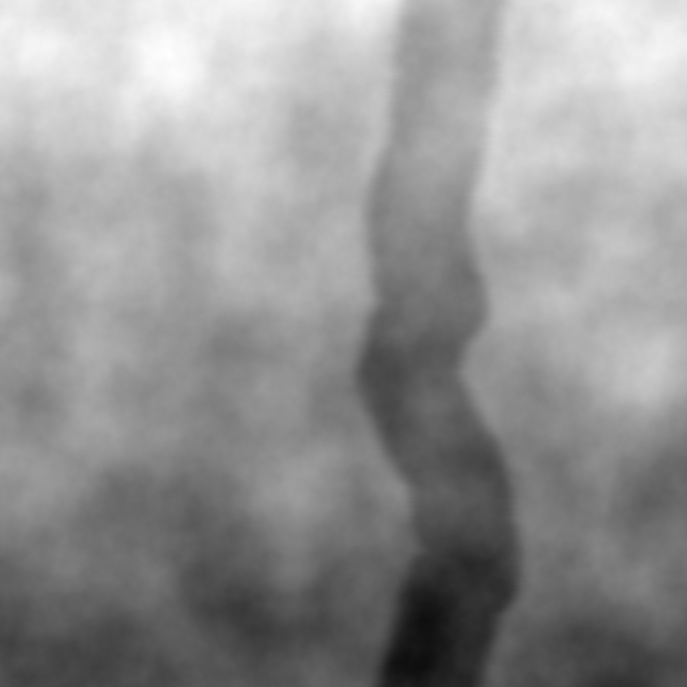
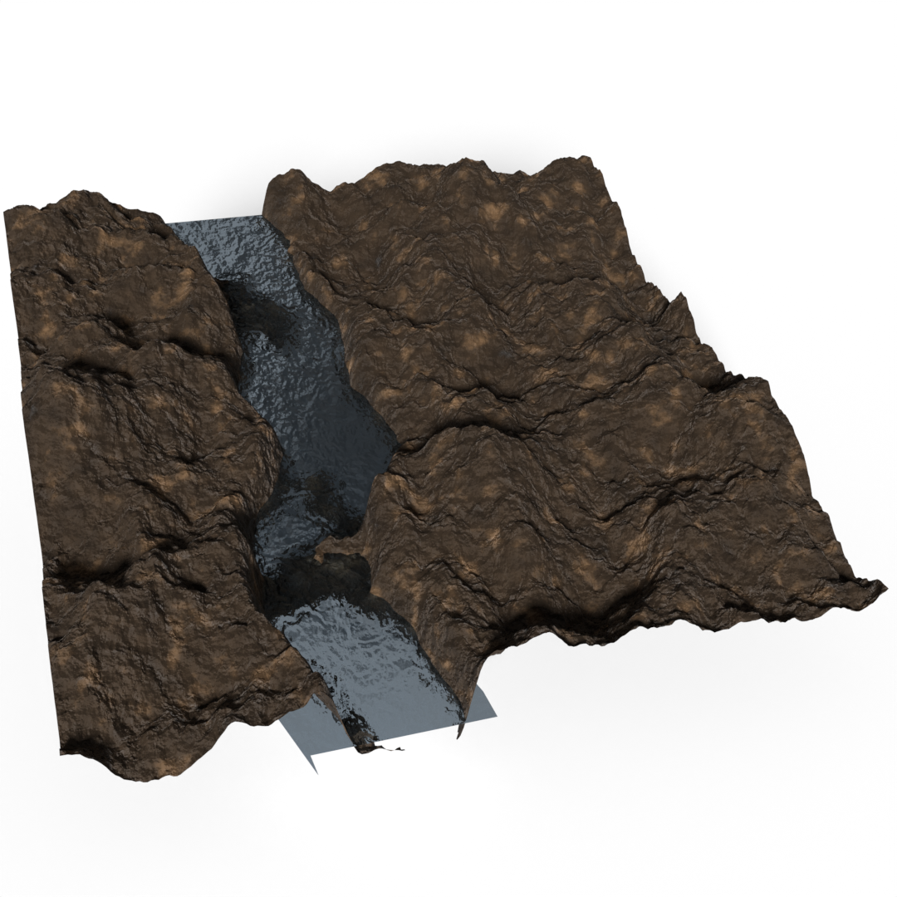

# River generator
This repository contains an application for procedural generation of heightmaps of
terrains containing rivers.

<!-- 
 -->
</img>
</img>

## Algorithm
The algorithm evolves through a series of steps, combining multiple techniques together.  

At first, the plane is sampled randomly, and two extra vertices are added outside the
relevant region at north and south (namely, `Ps` and `Pe`). The 
[Delaunay graph](https://en.wikipedia.org/wiki/Delaunay_triangulation) of the
samples is computed, and the shortest path from `Ps` to `Pe` is found. Using the samples
in the plane, a [spline](https://en.wikipedia.org/wiki/Spline_interpolation) is computed
and drawn with a certain thickness. The resulting image is blurred, and this process
concludes the generation of the river's bed.

On top of this, a pass of [Perlin](https://en.wikipedia.org/wiki/Perlin_noise) and 
[Voronoi](https://en.wikipedia.org/wiki/Voronoi_diagram) noise are added to introduce 
variety in the scene, generating a natural landscape.  

Finally, a smooth offset is applied to the plane, so to give an inclination to the river.


## Building instructions
The building process is entirely handled with CMake, and the required libraries are
included as external submodules. Despite being a command line application, SFML relies
on the system's ability to create GUI windows, so your system must be able to create a
window. If you are working on WSL, please be sure to update to WSL2.  

First, clone the repository and update the submodules.
```sh
git clone https://github.com/filthynobleman/river-generator.git --recursive
cd river-generator
git submodule update --init --recursive
```

Before building the application, you need to build the included SFML library.
```sh
mkdir sfml-build
cd sfml-build
cmake ../ext/sfml/ -DSFML_WARNINGS_AS_ERRORS=FALSE -DCMAKE_INSTALL_PREFIX=./install
cmake --build . --config release --parallel
cmake --install .
```

At this point, you can build the actual application
```sh
cd ..
mkdir build
cd build
cmake ..
cmake --build . --config release --parallel
```

The building process should produce a single executable named `RiverGen`.

## Usage
The application `RiverGen` only accepts a single argument, which is a configuration file
in JSON format. The configuration file must specify the following attributes:
 - `size` can be a single integer or an array of two integers that specifies the dimensions
 of the heightmap.
 - `width`/`height` can be used alternatively to `size`.
 - `output_file` specifies the path to the output heightmap. The application also uses this
 path to save the ouput map as a mesh in OBJ format.
 - `perlin` is a JSON object structured as follows:
   - `weight` specifies the coefficient of the Perlin noise component.
   - `scale` specifies the scale of the domain (_i.e._, the noise's frequency).
   - `octaves` specifies the number of octaves for the noise.
 - `voronoi` is a JSON object structured as follows:
   - `weight` specifies the coefficient of the Voronoi noise component.
   - `scale` specified the scale of the domain.
 - `river` is a JSON object structured as follows:
   - `nodes` specifies the number of nodes in the Delaunay triangulation.
   - `samples` specifies the number of samples for drawing the river's spline.
   - `thickness` specifies the thickness in pixels of the river.
   - `seed` specifies the seed used to sample the plane.
 - `gauss` is a JSON object structured as follows:
   - `ksx` specifies the size of the horizontal blur.
   - `ksy` specifies the size of te vertical blur.
   - `sigma` specifies the standard deviation of the kernel.
 - `plane` is a JSON object structured as follows:
   - `delta` specifies the difference in height between the beginning and end of the river.
   - `width` specifies the horizontal resolution of the output mesh.
   - `height` specifies the vertical resolution of the input mesh.

An example of configuration file can be found in the `configs` folder.


# TODOs
Currently, the river's height is set to one and cannot be changed, so the other settings must
be specified accordingly.  

At the moment, there is no way to specify the river's thickness proportionally, so when the
resolution of the image is changed, the thickness must be updated manually.  

The attributes in the configuration file must be all set, and no default value are provided.  

The path to the output mesh cannot be specified independently.  

Currently, the app has been tested only in a Linux environment.  

The app relies on SFML's RenderTexture objects to draw the river. These objects need GUIs to
perform their tasks, so an environment with the ability to open windows is needed.